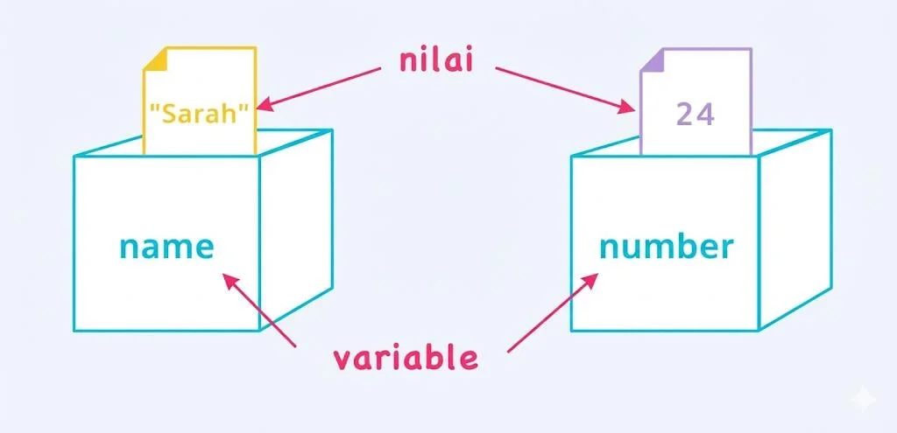

import { Aside } from '@astrojs/starlight/components';

Selamat datang di sesi pertama pembelajaran JavaScript! Di sesi ini, kita akan membangun fondasi yang kokoh dengan memahami konsep-konsep paling dasar yang akan menjadi pijakan untuk semua yang akan kita pelajari nanti.

---

## Materi: Pengetahuan & Konsep

### 1. Pengenalan JavaScript

#### 1.1. Apa itu JavaScript?

**JavaScript (JS)** adalah bahasa pemrograman yang awalnya dirancang untuk membuat halaman web menjadi lebih hidup dan interaktif.

Diciptakan pada tahun 1995 oleh **Brendan Eich** di Netscape, JavaScript telah berkembang pesat dari sekadar bahasa skrip browser menjadi bahasa yang bisa digunakan di mana saja, termasuk di server (berkat Node.js).

#### 1.2. Peran Standarisasi ECMAScript

Untuk memastikan kode JavaScript berjalan konsisten di semua browser, sebuah standar bernama **ECMAScript** dibuat.

Anggap saja ECMAScript sebagai "resep" atau "cetak biru" untuk bahasa JavaScript, sementara browser (seperti Chrome, Firefox) membuat "implementasi" dari resep tersebut. Inilah sebabnya mengapa JavaScript modern sering disebut dengan versi ECMAScript-nya, seperti ES6 (ECMAScript 2015).

---

### 2. Variabel: Kotak Penyimpanan Data Anda

#### 2.1. Apa Itu Variabel?

Bayangkan Anda memiliki sebuah kotak yang bisa Anda beri label nama. Anda bisa memasukkan apa saja ke dalam kotak itu, sebuah angka, sebaris teks, atau informasi lainnya. Kapan pun Anda membutuhkan isinya, Anda cukup memanggil nama kotak tersebut.

Dengan variabel, kita bisa menggunakan kembali data tanpa harus menuliskannya berulang kali.



#### 2.2. Cara Membuat Variabel: let dan const

Di JavaScript modern, ada dua kata kunci utama untuk membuat variabel:

**`let`** - Gunakan `let` saat nilai di dalam variabel mungkin perlu diubah di kemudian hari:

```javascript
// Contoh menggunakan let (nilai bisa diubah)
let umur = 25;
console.log(umur); // Output: 25

umur = 26; // Sah! Nilainya kita ubah
console.log(umur); // Output: 26
```

**`const`** - Gunakan `const` (singkatan dari constant) untuk nilai yang Anda tahu tidak akan pernah berubah:

```javascript
// Contoh menggunakan const (nilai tidak bisa diubah)
const namaLengkap = 'Budi Santoso';
console.log(namaLengkap); // Output: Budi Santoso

// Baris di bawah ini akan menyebabkan error jika dijalankan!
// namaLengkap = "Joko Widodo"; // TypeError: Assignment to constant variable
```

#### 2.3. Aturan Penamaan Variabel

Penamaan variabel di JavaScript memiliki aturan tertentu:

<Aside title="Aturan Wajib" icon="open-book">

- Harus dimulai dengan huruf, underscore `_`, atau dollar sign `$`
- Tidak boleh dimulai dengan angka
- Hanya boleh berisi huruf, angka, underscore, atau dollar sign
- Tidak boleh menggunakan reserved keywords (seperti `let`, `const`, `function`, dll)
- Case-sensitive (`nama` berbeda dengan `Nama`)

</Aside>

<Aside title="Best Practices" icon="open-book" type="tip">

- Gunakan camelCase untuk nama variabel (contoh: `namaLengkap`, `tanggalLahir`)
- Gunakan nama yang deskriptif dan bermakna
- Hindari nama satu huruf kecuali untuk counter loop

</Aside>

```javascript
// Penamaan yang BAIK
const firstName = 'Andi';
const userAge = 25;
const isActive = true;

// Penamaan yang BURUK
const a = 'Andi'; // Tidak deskriptif
const user_age = 25; // Gunakan camelCase, bukan snake_case
const ISACTIVE = true; // All caps untuk konstanta global saja
```

---

### 3. Tipe Data Inti

**Tipe data** adalah klasifikasi yang memberi tahu kita jenis nilai apa yang disimpan oleh sebuah variabel. Berikut adalah tipe data primitif yang paling sering digunakan.

#### 3.1. Number

Tipe data ini digunakan untuk semua jenis angka. Uniknya, di JavaScript tidak ada perbedaan antara bilangan bulat (integer) dan bilangan desimal (floating-point).

```javascript
let nomorUrut = 10; // Ini adalah Number
let harga = 1500.5; // Ini juga Number
let negatif = -42; // Number bisa negatif
let scientific = 2.5e6; // 2.5 juta dalam notasi scientific
```

**Nilai Number Khusus:**

```javascript
const infinity = 1 / 0; // Infinity
const negInfinity = -1 / 0; // -Infinity
const notANumber = 'abc' / 2; // NaN (Not a Number)

console.log(typeof NaN); // "number" (meskipun namanya Not a Number!)
```

#### 3.2. String

`String` adalah tipe data untuk merepresentasikan teks. Untuk menandakan sebuah nilai adalah string, kita harus membungkusnya dengan tanda kutip.

```txt
let sapaan = 'Halo, selamat pagi!'; // Kutip tunggal
let nama = "Andi"; // Kutip ganda
let alamat = `Jakarta Selatan`; // Backtick (template literal)

// String bisa digabungkan menggunakan operator +
let kalimatLengkap = sapaan + ' Nama saya ' + nama;
console.log(kalimatLengkap); // Output: Halo, selamat pagi! Nama saya Andi
```

**String dengan Template Literal:**

```javascript
const nama = 'Budi';
const umur = 25;

// Cara lama
const pesan1 = 'Nama saya ' + nama + ' dan umur saya ' + umur + ' tahun';

// Cara modern dengan template literal (lebih mudah dibaca)
const pesan2 = `Nama saya ${nama} dan umur saya ${umur} tahun`;

console.log(pesan2); // Output: Nama saya Budi dan umur saya 25 tahun
```

#### 3.3. Boolean

`Boolean` adalah tipe data yang paling sederhana dan hanya memiliki dua kemungkinan nilai: `true` (benar) atau `false` (salah). Tipe data ini sangat fundamental untuk logika kondisional dan struktur kontrol.

```javascript
let sudahLulus = true;
let sedangBermain = false;

const umur = 18;

// Boolean sering dihasilkan dari operasi perbandingan
let apakahDewasa = umur >= 18; // true jika umur >= 18
console.log(apakahDewasa);
```

---

### 4. Nilai Khusus: undefined dan null

Dua nilai khusus ini seringkali membingungkan bagi pemula, namun keduanya memiliki makna yang sangat berbeda.

#### 4.1. undefined

`undefined` adalah sebuah tipe data dan juga sebuah nilai. Ini merepresentasikan keadaan sebuah variabel yang telah dideklarasikan tetapi belum pernah diberi nilai.

```javascript
let namaHewan;
console.log(namaHewan); // Output: undefined
console.log(typeof namaHewan); // Output: "undefined"

// Fungsi yang tidak return apa-apa juga menghasilkan undefined
function tidakReturnApapun() {
  let x = 10;
}
console.log(tidakReturnApapun()); // Output: undefined
```

#### 4.2. null

`null` adalah sebuah nilai yang diberikan secara sengaja untuk merepresentasikan "tidak ada nilai" atau "kosong". Berbeda dengan `undefined`, `null` harus ditetapkan secara eksplisit oleh programmer.

```javascript
let dataPemenang = null; // Kita sengaja set nilainya menjadi null
console.log(dataPemenang); // Output: null
console.log(typeof dataPemenang); // Output: "object" (ini adalah bug JavaScript yang terkenal!)

// Gunakan null untuk menandakan "sengaja dikosongkan"
let selectedUser = { name: 'Andi' };
selectedUser = null; // User di-deselect
```

**Perbedaan undefined vs null:**

| undefined                        | null                                  |
| :------------------------------- | :------------------------------------ |
| Otomatis diberikan JavaScript    | Diberikan secara eksplisit programmer |
| Berarti "belum diberi nilai"     | Berarti "sengaja dikosongkan"         |
| `typeof undefined` → "undefined" | `typeof null` → "object"              |

---

### 5. Hoisting: Bagaimana JavaScript "Mengangkat" Deklarasi

**Hoisting** adalah perilaku JavaScript yang "mengangkat" deklarasi variabel dan fungsi ke bagian atas scope mereka sebelum kode dieksekusi.

#### 5.1. Hoisting dengan var (Hindari!)

```javascript
console.log(umur); // Output: undefined (bukan error!)
var umur = 25;
console.log(umur); // Output: 25

// Di balik layar, JavaScript memperlakukannya seperti ini:
// var umur;              // Deklarasi di-hoist ke atas
// console.log(umur);     // undefined
// umur = 25;             // Assignment tetap di posisi asli
// console.log(umur);     // 25
```

#### 5.2. Hoisting dengan let dan const

Berbeda dengan `var`, `let` dan `const` juga di-hoist, tetapi mereka tidak diinisialisasi. Mereka berada dalam **Temporal Dead Zone (TDZ)** dari awal blok hingga deklarasi tercapai.

```javascript
// Ini akan error!
console.log(nama); // ReferenceError: Cannot access 'nama' before initialization
let nama = 'Budi';

// const juga sama
console.log(PI); // ReferenceError: Cannot access 'PI' before initialization
const PI = 3.14;
```

#### 5.3. Temporal Dead Zone (TDZ)

**TDZ** adalah periode waktu antara saat scope dimulai hingga variabel dideklarasikan, di mana variabel tidak dapat diakses.

```javascript
{
  // TDZ dimulai untuk 'nama'
  console.log(nama); // ReferenceError - masih di TDZ

  let nama = 'Andi'; // TDZ berakhir, 'nama' sekarang bisa diakses
  console.log(nama); // "Andi"
}
```

**Mengapa TDZ ada?**

- Membantu menangkap bugs lebih awal
- Mendorong praktik deklarasi variabel di awal
- Membuat kode lebih predictable

**Best Practice:**
Selalu deklarasikan variabel di bagian atas scope mereka untuk menghindari masalah TDZ.

---

### 6. Type Coercion: Konversi Tipe Otomatis

**Type Coercion** adalah proses konversi otomatis dari satu tipe data ke tipe data lain yang dilakukan JavaScript.

#### 6.1. Implicit Coercion (Otomatis)

JavaScript sering mengkonversi tipe data secara otomatis dalam operasi tertentu:

```javascript
// String + Number = String (number dikonversi jadi string)
console.log('Nilai: ' + 5); // "Nilai: 5"
console.log('10' + 20); // "1020" (bukan 30!)

// Number + Boolean = Number (true jadi 1, false jadi 0)
console.log(5 + true); // 6
console.log(5 + false); // 5

// String dalam operasi matematika non-plus dikonversi ke Number
console.log('10' - 5); // 5
console.log('10' * 2); // 20
console.log('10' / 2); // 5
```

#### 6.2. Explicit Coercion (Manual)

Kita bisa melakukan konversi tipe secara eksplisit untuk lebih jelas:

```javascript
// String ke Number
const str = '123';
const num1 = Number(str); // 123
const num2 = parseInt(str); // 123 (khusus integer)
const num3 = parseFloat('12.5'); // 12.5

// Number ke String
const angka = 123;
const str1 = String(angka); // "123"
const str2 = angka.toString(); // "123"

// Ke Boolean
console.log(Boolean(1)); // true
console.log(Boolean(0)); // false
console.log(Boolean('hello')); // true
console.log(Boolean('')); // false
```

#### 6.3. Jebakan Umum dengan Type Coercion

```javascript
// Perbandingan dengan == (loose equality) - melakukan coercion
console.log(5 == '5'); // true (string '5' dikonversi ke number)
console.log(0 == false); // true
console.log(null == undefined); // true

// Perbandingan dengan === (strict equality) - TIDAK melakukan coercion
console.log(5 === '5'); // false (tipe berbeda)
console.log(0 === false); // false
console.log(null === undefined); // false
```

**Best Practice:**
Gunakan `===` dan `!==` untuk perbandingan agar menghindari hasil yang tidak terduga dari type coercion.

---

### 7. Mengecek Tipe Data dengan typeof

Operator `typeof` digunakan untuk mengetahui tipe data dari sebuah nilai:

```javascript
console.log(typeof 42); // "number"
console.log(typeof 'Hello'); // "string"
console.log(typeof true); // "boolean"
console.log(typeof undefined); // "undefined"
console.log(typeof null); // "object" (bug JavaScript!)
console.log(typeof {}); // "object"
console.log(typeof []); // "object" (array adalah object)
console.log(typeof function () {}); // "function"
```

---

## Praktik

### Latihan 1: Deklarasi Variabel

**Tingkat**: Dasar

**Tujuan**: Memahami perbedaan `let` dan `const`

**Instruksi**:

1. Buat variabel `namaDepan` dengan `const` berisi nama depan Anda
2. Buat variabel `umur` dengan `let` berisi umur Anda
3. Tampilkan keduanya dengan `console.log()`
4. Coba ubah nilai `umur` menjadi umur + 1
5. Coba ubah nilai `namaDepan` (akan error - ini normal!)

### Latihan 2: Type Coercion

**Tingkat**: Dasar

**Tujuan**: Memahami bagaimana JavaScript mengkonversi tipe data

**Instruksi**:
Tanpa menjalankan kode, prediksi output dari kode berikut:

```javascript
console.log('5' + 3);
console.log('5' - 3);
console.log('5' * 2);
console.log(10 + true);
console.log('10' == 10);
console.log('10' === 10);
```

Setelah prediksi, jalankan kodenya dan bandingkan hasilnya!

### Latihan 3: Menghindari Hoisting Issues

**Tingkat**: Menengah

**Tujuan**: Memahami Temporal Dead Zone dan menghindari bug

**Instruksi**:
Kode berikut memiliki bug. Identifikasi masalahnya dan perbaiki:

```javascript
function hitungTotal() {
  console.log(`Jumlah barang: ${jumlahBarang}`);

  const hargaSatuan = 10000;
  let jumlahBarang = 5;

  return hargaSatuan * jumlahBarang;
}
```

### Latihan 4: Tipe Data dan typeof

**Tingkat**: Menengah

**Tujuan**: Memahami berbagai tipe data dan cara mengeceknya

**Instruksi**:
Buat variabel dengan setiap tipe data berikut dan gunakan `typeof` untuk memverifikasi:

- Number (gunakan angka desimal)
- String (gunakan template literal)
- Boolean
- undefined
- null (perhatikan hasilnya!)

### Tantangan: Kalkulator Sederhana

**Tingkat**: Menengah

**Tujuan**: Menggabungkan semua konsep yang dipelajari

**Instruksi**:
Buat program sederhana yang:

1. Menyimpan dua angka dalam variabel menggunakan `const`
2. Hitung penjumlahan, pengurangan, perkalian, dan pembagian
3. Simpan hasil dalam variabel menggunakan `let`
4. Tampilkan semua hasil dengan format yang rapi menggunakan template literal

Contoh output:

```
Angka 1: 10
Angka 2: 5
Penjumlahan: 15
Pengurangan: 5
Perkalian: 50
Pembagian: 2
```

---

## Rangkuman Sesi 1

Selamat! Anda telah mempelajari pilar-pilar dasar JavaScript:

- **JavaScript** adalah bahasa serbaguna yang telah berkembang dari bahasa skrip browser menjadi bahasa yang bisa digunakan di mana saja
- **Variabel** (`let` dan `const`) adalah wadah untuk menyimpan data - gunakan `const` secara default, `let` hanya saat nilai perlu diubah
- **Tipe Data** dasar mencakup `Number`, `String`, dan `Boolean`
- **`undefined`** berarti variabel belum diberi nilai, sedangkan **`null`** berarti variabel sengaja diberi nilai kosong
- **Hoisting** mengangkat deklarasi ke atas, tapi `let` dan `const` memiliki **Temporal Dead Zone**
- **Type Coercion** adalah konversi tipe otomatis - gunakan `===` untuk menghindari hasil tidak terduga

Di sesi berikutnya, kita akan belajar bagaimana cara mengolah data-data ini menggunakan operator!
