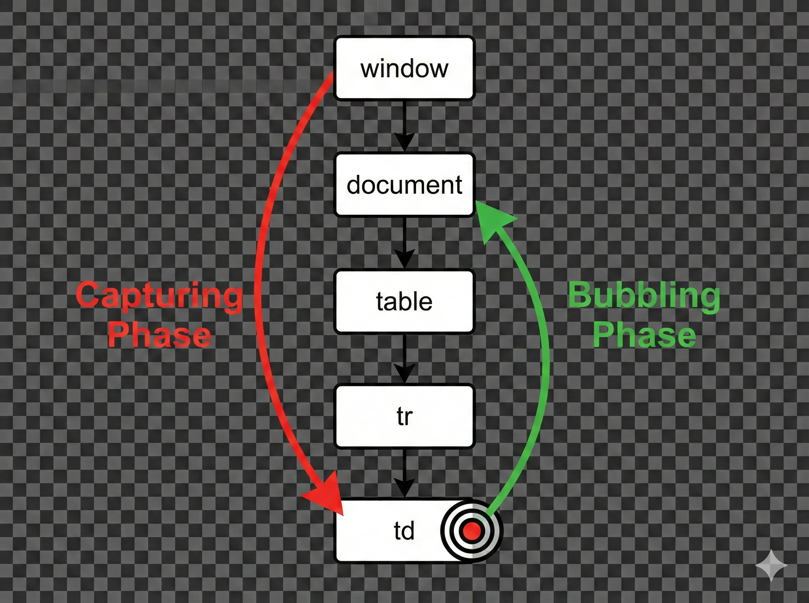

Ini adalah "Teknik Ninja" dalam DOM Manipulation. Bayangkan Anda punya 1000 item list. Memasang 1000 event listener adalah pemborosan memori yang masif.

Solusinya? **Event Delegation**.

---

## 1. Event Bubbling & Capturing

Sebelum masuk ke delegation, kita harus paham perjalanan sebuah event. Saat Anda klik sebuah tombol `<td>` dalam tabel `<table>`:

1.  **Capturing Phase**: Event turun dari `window` -> `document` -> `table` -> `tr` -> `td`.
2.  **Target Phase**: Event sampai di target (`td`).
3.  **Bubbling Phase**: Event **naik kembali** ke atas: `td` -> `tr` -> `table` -> `document`.

Secara default, `addEventListener` mendengarkan pada fase **Bubbling**.



## 2. Event Delegation (Pendelegasian)

Daripada memasang listener di **setiap anak**, kita pasang **satu listener di bapaknya** (Parent). Karena event "bubble up", si bapak akan tahu kalau anaknya diklik.

### Keuntungan:

1.  **Hemat Memori**: Cuma 1 listener vs 1000 listener.
2.  **Dinamis**: Elemen baru yang ditambahkan nanti (ajax/append) **otomatis bekerja** tanpa perlu pasang listener lagi.

```javascript
// KASUS: Daftar item belanja
const listBelanja = document.getElementById('list-belanja');

// Cara Delegation (Pasang di Parent 'UL')
listBelanja.addEventListener('click', (e) => {
  // Cek apakah yang diklik adalah tombol 'Hapus'
  // Menggunakan .closest() untuk akurasi jika di dalam tombol ada icon
  if (e.target.closest('.btn-hapus')) {
    const item = e.target.closest('li');
    item.remove(); // Hapus item belanja
  }

  // Cek apakah yang diklik adalah teks (toggle coret)
  if (e.target.tagName === 'SPAN') {
    e.target.classList.toggle('selesai');
  }
});
```

## 3. Custom Events

Selain event bawaan (`click`, `submit`), Anda bisa membuat event sendiri untuk komunikasi antar komponen.

```javascript
// 1. Buat Event Baru
const loginEvent = new CustomEvent('userLogin', {
  detail: { username: 'Budi', role: 'Admin' }, // Kirim data
});

// 2. Dengarkan Event (di bagian lain kode)
document.addEventListener('userLogin', (e) => {
  console.log(`Selamat datang, ${e.detail.username}!`);
});

// 3. Trigger Event (Dispatch)
document.dispatchEvent(loginEvent);
```

---

## Praktik Sesi 9

Kita akan membuat **Galeri Foto Dinamis** menggunakan Event Delegation.

**1. Siapkan `index.html`:**

```html
<div id="gallery-container">
  <!-- Gambar akan digenerate JS -->
</div>
<button id="add-image">Tambah Gambar</button>
```

**2. Tulis `app.js`:**

```javascript
const container = document.getElementById('gallery-container');
const btnAdd = document.getElementById('add-image');

// 1. Event Delegation pada Container (Menghandle ribuan gambar pun siap!)
container.addEventListener('click', (e) => {
  const card = e.target.closest('.photo-card');
  if (!card) return; // Klik di ruang kosong, abaikan

  // Aksi: Hapus Gambar
  if (e.target.classList.contains('btn-delete')) {
    card.remove();
    return;
  }

  // Aksi: Like Gambar
  if (e.target.classList.contains('btn-like')) {
    e.target.innerText = '❤️ Liked';
    e.target.style.color = 'red';
    return;
  }

  // Aksi: Klik Gambar (Zoom)
  if (e.target.tagName === 'IMG') {
    alert(`Zoom gambar: ${e.target.alt}`);
  }
});

// Helper: Generate Gambar Acak
btnAdd.addEventListener('click', () => {
  const id = Math.floor(Math.random() * 1000);
  const div = document.createElement('div');
  div.className = 'photo-card';
  div.style =
    'border:1px solid #ddd; padding:10px; margin:5px; display:inline-block; text-align:center';

  div.innerHTML = `
        
        <br>
        <button class="btn-like">Like</button>
        <button class="btn-delete">Hapus</button>
    `;

  container.appendChild(div);
});
```

**Misi Anda:**

1.  Klik "Tambah Gambar" beberapa kali.
2.  Coba klik tombol "Like" atau "Hapus" pada gambar yang _baru saja_ muncul.
3.  Perhatikan bahwa **tanpa** kita pasang `addEventListener` khusus pada tombol baru tersebut, mereka tetap berfungsi. Itulah _magic_ dari Event Delegation!

Di **Sesi 10**, kita akan masuk ke materi yang sangat krusial untuk aplikasi bisnis: **Scripting Web Forms**. Validasi input, Radio Button, Checkbox, dan Select Box.
