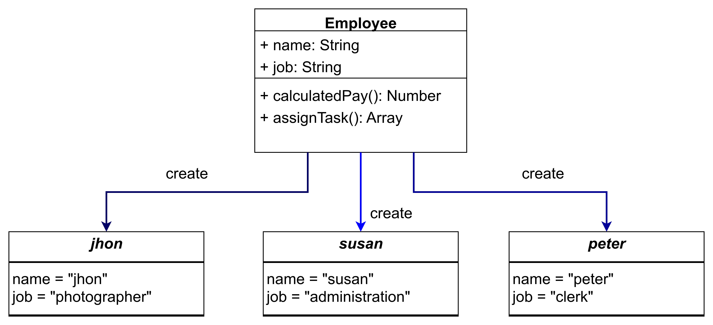

## Materi: Pengetahuan & Konsep

**Object Oriented Programming (OOP)** adalah paradigma pemrograman modern yang memandang kode sebagai kumpulan objek, di mana segala sesuatu dikelola melalui objek untuk membuat kode lebih reusable, scalable, dan mudah dipelihara.

Di JavaScript, OOP populer karena mendukung pengembangan aplikasi web cutting-edge seperti SPA (Single Page Application) dengan framework React atau Vue.

**Object** adalah instance data nyata yang menyimpan _properties_ (atribut/field seperti nama atau umur) dan _methods_ (fungsi/behavior seperti berjalan atau makan), mirip entitas dunia nyata.

**Class** berfungsi sebagai blueprint atau cetakan untuk menghasilkan banyak object dengan struktur sama; satu class bisa spawn object tak terbatas, memastikan konsistensi data.



JavaScript aslinya dirancang prosedural, sehingga OOP-nya berbasis _prototype-based_ bukan class murni seperti Java/C++, tapi ES6+ memperkenalkan _syntactic sugar_ class untuk kemudahan tanpa mengubah mekanisme inti.

## Praktik

Coba buat object literal sederhana (non-OOP) untuk pahami dasar, jalankan di browser console:

```javascript
// Object literal sederhana (unik, bukan dari cetakan)
const person = {
  nama: 'Emma',
  umur: 30,
  sapa() {
    console.log(`Halo, saya ${this.nama}`);
  },
};
person.sapa(); // Output: Halo, saya Emma
```
