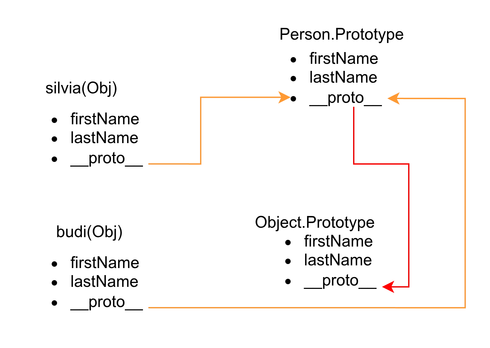

Sesi kali ini, membahas **Prototype di JavaScript**:

- bagaimana cara kerja prototype,
- prototype chain, dan
- cara menambahkan method di prototype agar dibagi semua instance.

## Materi: Pengetahuan & Konsep

JavaScript secara historis adalah bahasa **prototype-based**, artinya konsep pewarisan dan reuse behavior utamanya lewat _prototype object_, bukan class seperti di Java atau C#.

Setiap constructor function otomatis punya object `prototype`, dan setiap kali `new Constructor()` dipanggil, object hasilnya akan punya link internal (`[[Prototype]]` atau `__proto__`) ke `Constructor.prototype`.

Saat mengakses `obj.someProp`, JavaScript akan cek urut:

1. di object itu sendiri,
2. kalau tidak ada, naik ke `obj.__proto__` (yaitu `Constructor.prototype`),
3. terus naik ke parent berikutnya sampai ujungnya `Object.prototype`. Pola lookup berantai ini disebut **prototype chain**, dan memungkinkan semua instance berbagi method yang didefinisikan di prototype tanpa duplikasi di setiap object.



## Praktik

Coba pergi ke **_console_** untuk melihat bedanya method yang berada di instance vs di prototype:

```javascript
// Constructor dasar
function Person(firstName, lastName) {
  this.firstName = firstName;
  this.lastName = lastName;

  // Method di instance (kurang efisien kalau banyak object)
  this.sayHello = function (name) {
    console.log(`Halo ${name}, nama saya ${this.firstName}`);
  };
}

// Tambah method di prototype (shared ke semua instance)
Person.prototype.sayBye = function () {
  console.log(`Sampai jumpa dari ${this.firstName}`);
};

const silvia = new Person('Silvia', 'Khaira');
const budi = new Person('Budi', 'Nugraha');

console.log(silvia);

silvia.sayHello('Sulis'); // Halo Sulis, nama saya Silvia
silvia.sayBye(); // Sampai jumpa dari Silvia
budi.sayBye(); // Sampai jumpa dari Budi

console.log(silvia.__proto__ === Person.prototype); // true
```

Di DevTools, expand `silvia` dan lihat bahwa `sayHello` ada di object `silvia`, sedangkan `sayBye` ada di `[[Prototype]]` (`Person.prototype`).

Sesi berikutnya akan fokus ke **Prototype Inheritance** (pewarisan antar prototype, misal `Employee` -> `Manager`).
