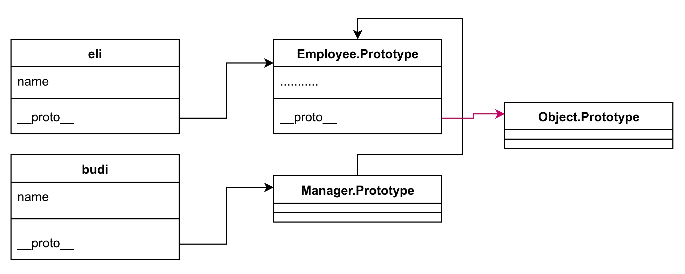
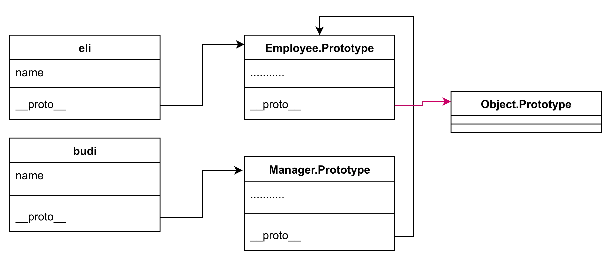

## Materi: Pengetahuan & Konsep

**Prototype Inheritance** memungkinkan satu constructor "mewarisi" behavior dari constructor lain via prototype chain, bukan hanya copy property seperti `.call()` di Sesi 5.

Ini adalah mekanisme inti OOP di JavaScript pre-ES6, memungkinkan **polymorphism** dan method overriding yang efisien tanpa duplikasi memory.

**Kesalahan umum**:

Jika kita menulis `Manager.prototype = Employee.prototype` langsung, hanya membuat _reference_ ke object yang sama, jadi override method di `Manager` akan merusak `Employee` – **hindari ini!**

**Solusi benar:**

Tulislah `Manager.prototype = Object.create(Employee.prototype)` .

Itu membuat _new object_ yang inherit dari `Employee.prototype`, menjaga isolasi dan memungkinkan method overriding aman.

Chain-nya jadi:

`managerInstance` → `Manager.prototype` → `Employee.prototype` → `Object.prototype`.

**Contoh salah**



**Contoh benar**



## Praktik

Coba pattern benar di console; perhatikan method override:

```javascript
// Parent constructor
function Employee(name) {
  this.name = name;
}

// Child constructor
function Manager(name) {
  this.name = name;
}

// SALAH: Manager.prototype = Employee.prototype;
// BENAR: Buat prototype chain
Manager.prototype = Object.create(Employee.prototype);

// Tambah method ke parent prototype
Employee.prototype.sayHello = function (name) {
  console.log(`Hello ${name}, my name is employee ${this.name}`);
};

// Override method di child prototype
Manager.prototype.sayHello = function (name) {
  console.log(`Hello ${name}, my name is manager ${this.name}`);
};

const eli = new Employee('Eli');
const budi = new Manager('Budi');

eli.sayHello('Joko'); // Output: Hello Joko, my name is employee Eli
budi.sayHello('Joko'); // Output: Hello Joko, my name is manager Budi

console.log(eli instanceof Employee); // true
console.log(budi instanceof Employee); // true (inheritance works!)
```

Coba inspect `budi.__proto__` di DevTools – lihat chain ke `Manager.prototype` lalu `Employee.prototype`.
